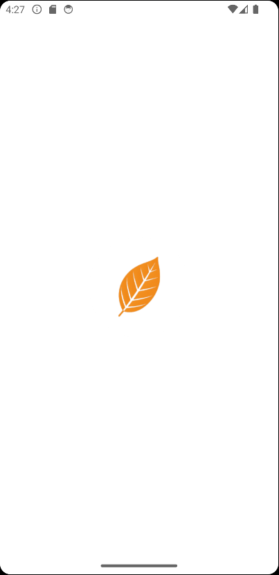
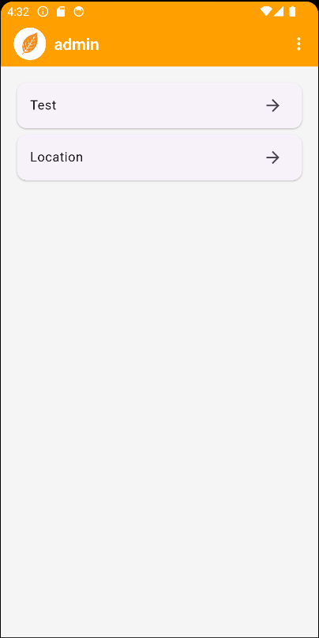
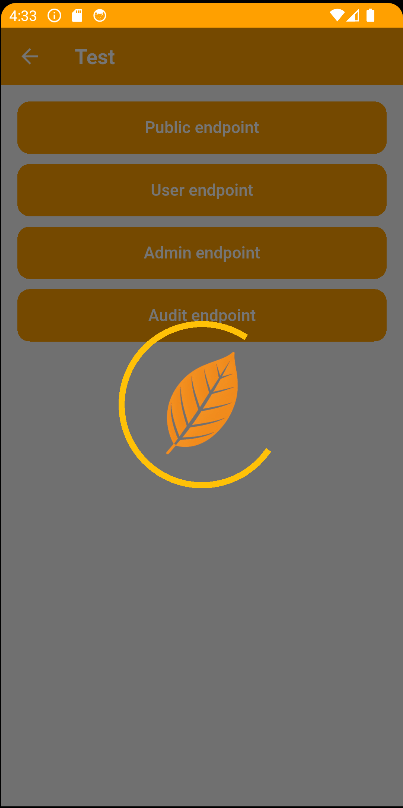

# Flutter App Template with Login

This is a **production-ready Flutter app template** designed to kickstart any Flutter frontend application with modern essentials — built with **simplicity**, **scalability**, and **maintainability** in mind.

> This project works seamlessly with the backend project: [springboot-essentials-template](https://github.com/daiki1/springboot-essentials-template)

---

> ⚠️ **Personal Portfolio Project**  
> You are free to view and learn from the code.  
> Please **do not use it as-is** in commercial projects.

---

## Table of Contents

- [Features](#features)
- [Acknowledgements](#acknowledgements)
- [Tools & Technologies](#tools--technologies)
- [Dependencies](#dependencies)
- [Getting Started](#getting-started)


---

## Features

- **Login system**:
  - Login
  - Sign Up
  - Forgot Password (request code)
  - Reset Password (with code)
- Connects to Spring Boot backend with full JWT-based authentication
- Role-based API access demo:
  - Test endpoints that return success or error based on user roles/permissions
- **Multi-language support** (English 🇺🇸 / Spanish 🇪🇸):
  - Language can be changed from **Login screen** or **Home menu**
- **Location picker example**:
  - Select Country → State → City (demonstrates API connection flow)
- Flutter version: **3.32.0**
- Dart version: **3.8.0**
- Android Studio with **Java 21**
- Custom reusable widgets:
  - Button
  - Dropdown
  - Input field
  - Popup dialog
- Global loader overlay
- Language selector
- App configuration for changing the backend IP
- Centralized error handling
- Refresh token logic with session expiration message
- `post` and `get` functions customized for consistent API usage
- `translation.dart` extending `Translations` from GetX
- Field validators
- State management using **GetX** with `Obx`

---

## Acknowledgements

- This project was developed with the assistance of [ChatGPT](https://chat.openai.com) for guidance on various aspects such as project setup, configuration, and best practices.
- **GitHub Copilot** was used for code suggestions and assistance during development.

---

## Tools & Technologies

- Flutter
- Dart
- GetX
- REST API (Spring Boot backend)
- Android Studio
- Git & GitHub
- Localization
- JWT handling

---

## Dependencies

```yaml
dependencies:
  http: ^1.4.0
  get: ^4.7.2 
  jwt_decode: ^0.3.1
  get_storage: ^2.1.1
  flutter_localization: ^0.3.2
dev_dependencies:
  flutter_lints: ^5.0.0
  flutter_launcher_icons: ^0.14.3
  flutter_native_splash: ^2.4.6
  ```
---

## Getting Started

### Prerequisites

Ensure you have the following tools installed:

- [Flutter 3.32.0](https://docs.flutter.dev/get-started/install)
- [Dart 3.8.0](https://dart.dev/get-dart)
- [Android Studio](https://developer.android.com/studio) (Java 21 required)
- [Git](https://git-scm.com/)

### Clone the Repository

```bash
git clone https://github.com/YOUR_USERNAME/YOUR_REPO_NAME.git
cd YOUR_REPO_NAME
```

### Configure the Backend IP
Open `lib/config/app_config.dart` and set the `backendIp` variable to your backend server's IP address or domain name.

```dart
static const String apiBaseUrl = "http://<your-ip>:<port>";
```

### Run the App
```bash
flutter pub get
flutter run
```

---

## Screenshots

### Splash Screen


### Login Screen


### Home Screen


### Loading Screen
